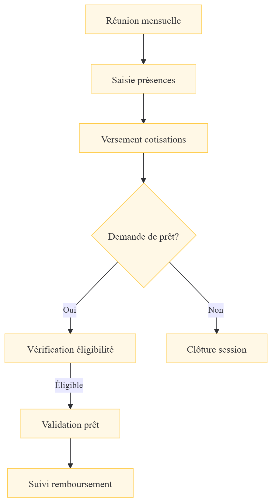

Application de gestion financière complète pour associations, avec focus sur la gestion des cotisations, fonds de roulement et prêts entre membres.


## 📋 Table des matières

- [Fonctionnalités](#-fonctionnalités)
- [Architecture financière](#-architecture-financière)
- [Installation](#-installation)
- [Configuration](#-configuration)
- [Utilisation](#-utilisation)
- [API Documentation](#-api-documentation)
- [Contributing](#-contributing)

## ✨ Fonctionnalités

### Gestion des Membres
- Inscription et profils membres
- Suivi des présences aux réunions
- Historique des cotisations
- Statut de contributeur au fonds de roulement

### Cotisations
- Cotisation mensuelle minimale : **15 000 F CFA**
- Frais de présence : **1 000 F CFA**
- Contribution fonds de roulement : **5 000 F CFA**
- **Total mensuel : 21 000 F CFA**

| Membre | Cotisation | Présence | Fonds roulement | Total |
|--------|-----------|----------|-----------------|-------|
| Standard | 15 000 | 1 000 | 5 000 | **21 000** |
| Patrice & Sandrine | - | 1 000 | - | **1 000** |
| Wilfried | - | 1 000 | 5 000 | **6 000** |

### Fonds de Roulement
- Capital initial : **80 000 F CFA**
- Prêts internes aux membres à jour
- Taux d'intérêt : **10% sur 3 mois**
  - 2% pour l'association (AFAY)
  - 8% répartis proportionnellement aux contributeurs

### Système de Prêts

**Conditions d'éligibilité**
- ✅ Être à jour des cotisations
- ✅ Faire partie des contributeurs au fonds de roulement

**Sanctions en cas de défaut**

| Infraction | Pénalité |
|-----------|----------|
| "Bouffer" le fonds (non-remboursement) | 50% amende + remboursement intégral avant prochaine cotisation |
| Retard sans consommation | 5 000 F CFA |
| Réception annoncée < 7 jours | 1 000 F CFA |

**Quorum pour réception**
- Minimum 5 présents (Douala & Yaoundé)
- Débat autorisé pour les autres villes

## 🏗 Architecture financière
┌─────────────────────────────────────────┐
│           FONDS DE ROULEMENT            │
│              80 000 F CFA               │
├─────────────────────────────────────────┤
│  Prêt interne (taux 10% / 3 mois)      │
│  ├── 2% → AFAY (association)           │
│  └── 8% → Répartition contributeurs    │
│       (selon part dans le fonds)       │
└─────────────────────────────────────────┘


## 🚀 Installation

### Prérequis
- Node.js ≥ 18
- PostgreSQL ≥ 14
- npm ou yarn

### Backend

```bash
# Cloner le repository
git clone https://github.com/votre-org/afay-gestion.git
cd afay-gestion/server

# Installer les dépendances
npm install

# Configuration environnement
cp .env.example .env
# Éditer .env avec vos credentials DB

# Base de données
npx prisma migrate dev
npx prisma db seed

# Lancer le serveur
npm run dev

